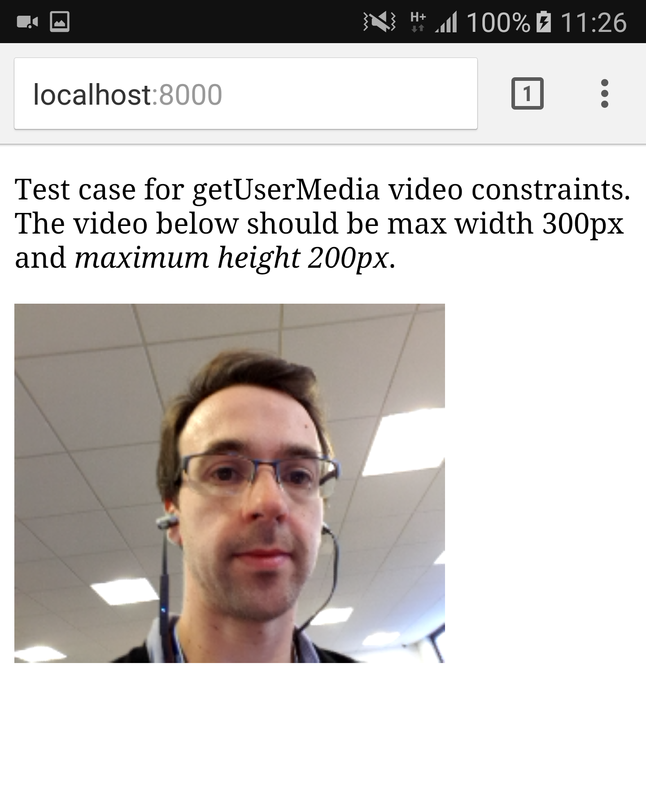

# getUserMedia constraints test case

Uses the [WebRTC Adapter](https://github.com/webrtc/adapter) for a consistent API.

From: https://developer.mozilla.org/en-US/docs/Web/API/MediaDevices/getUserMedia

**"An application can request the camera and microphone capabilities it needs and wants, 
using additional constraints... The keywords min, max, and exact are inherently mandatory..."**

Unfortunately in Samsung Internet the ideal `width` constraint is observed, but the max 
(and ideal) `height` is ignored.

### Chrome:

### Samsung Internet:

